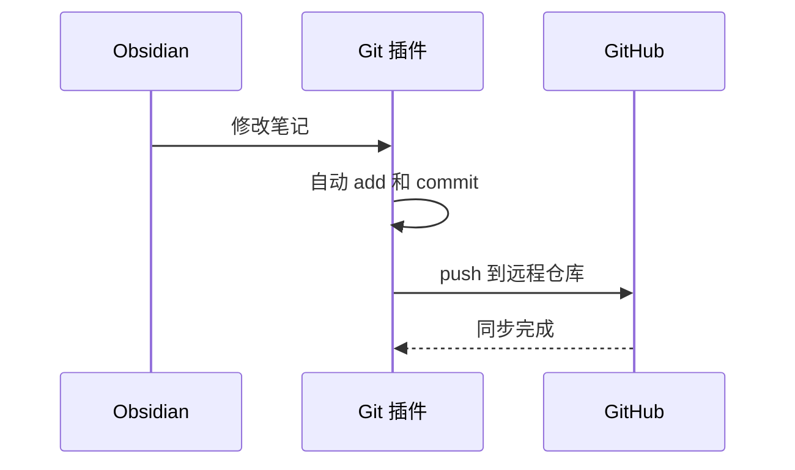

# 00-Obsidian与auto-git
## 一，前言
最近开始用 Obsidian，觉得这种本地优先、基于 Markdown 的笔记软件挺靠谱，适合量产~~垃圾~~。

不用忍受印象笔记那种满屏的广告，也不用像Typora 一样专门花钱购买，还能自己免费 GitHub 自动云备份，所以就全面转向 Obsidian，下面记录一下

[ Obsidian 中文帮助](https://obsidian.md/zh/help/syntax)


---

## 二，下载与安装
[官方下载地址](https://obsidian.md/download)

下载完直接默认安装即可，可以改路径

建议为所有用户安装


---

## 三，使用和Markdown
基础 Markdown 语法网上都有讲解，这里就不重复造轮子了，推荐一下教程

[Markdown 文档基础语法](https://www.bilibili.com/video/BV1eJ4m157kC/?)

[基本格式语法 - Obsidian 中文帮助](https://obsidian.md/zh/help/syntax)


看一下高级Markdown扩展语法，知乎和CSDN还有其他的应该都不支持，我用md写到代码块里面，这应该是最常用的

###  内部链接：`[[笔记名]]`  
  
Obsidian 最核心的功能之一是内部链接，也就是用双中括号连接不同笔记。  
  
```markdown  
[[插件介绍]]  
```  
  
这样可以直接链接到另一篇笔记。如果目标笔记不存在，点击后也可以快速创建。  
  
还可以给链接设置显示文字：  
  
```markdown  
[[插件介绍|点击查看插件介绍]]  
```  
  

### Callout 标注块 
  
Obsidian 支持超高级引用块，也叫 Callout。写法如下：  
  
```markdown  
> [!note]  
> 这是一个普通标注块。  
```  
  
也可以给标注块加标题：  
  
```markdown  
> [!tip] 小提示  
> Obsidian 的标注块很适合写教程中的提示、注意事项和补充说明。  
```  
  
常见类型有：  
  
```markdown  
> [!note] 说明  
> 用于普通说明。  
  
> [!tip] 提示  
> 用于技巧和建议。  
  
> [!warning] 注意  
> 用于提醒风险。  
  
> [!question] 问题  
> 用于提出问题。  
  
> [!todo] 待办  
> 用于记录任务。  
  
> [!example] 示例  
> 用于展示例子。  
```  

  
###  可折叠标注块  
  
Callout 还可以设置为可折叠。  
  
默认展开：  
  
```markdown  
> [!faq]+ 这个标注可以折叠吗？  
> 收起  
```  
  
默认收起：  
  
```markdown  
> [!faq]- 这个标注可以默认收起吗？  
> 隐藏  
```  
  

###  Mermaid 图表  
  
Obsidian 支持 Mermaid，~~妈妈再也不用担心我的软件工程作业图~~
  

高级时序图示例：  
  

  
  
  
### HTML 内容  
  
Obsidian 支持在 Markdown 中直接写一部分 HTML，只会渲染一部分HTML
 
```html  
<p align="center">  
  
</p>  
```  
  
还有一些建议直接看

[Obsidian 风格的 Markdown 语法 - Obsidian 中文帮助](https://obsidian.md/zh/help/obsidian-flavored-markdown)

---

## 四，git插件
### `git init`
可以建立远程仓库，然后`git clone`到本地

或者先` git init` 一下，然后再发送到远端。这两种方法都可以。

总之，最终让本地 Obsidian 这个文件库被 Git 初始化即可。

### 配置`.gitignore`文件

打开左下角设置，找到文件与链接


> 更改删除策略，免得每次放到系统回收站，方便处理删除的文件

 .gitignore 文件写下面内容


```
# Obsidian 工作区状态，容易频繁变化
.obsidian/workspace.json
.obsidian/workspaces.json
.obsidian/workspace-mobile.json

# Obsidian 回收站
.trash/

# 系统垃圾文件
.DS_Store
Thumbs.db
```
> 这里工作区就是指各个菜单栏之间的状态，会经常变化，容易发生冲突，所以放到ignore里面


### 关闭安全模式与寻找第三方插件

打开左下角设置，找到第三方插件


**这里如果第一次打开 Obsidian，在第三方插件这个板块里面会显示有一个“关闭安全模式”。点击这个“关闭安全模式”以后，才能显示出我下面的这个图片。这里我提前关了**


然后就能搜索插件了


### 下载安装git插件


> 安装


> 启用

### 配置git 插件设置


> 调整设置


> 勾选下面的，上面输入的空是：当你停止编辑这个  Markdown 文件几分钟时，它就sync一次。我这里填2，就是指停止编辑这个 Obsidian Markdown 文件2分钟时，它就sync一次。


> 往下翻把pull打开，否则不会自动`git pull`

这里auto-sync，相当于经典的四件套

```
git add .
git commit -m "add files"
git pull
git push
```

如果自动同步有问题的话，可以自己打开命令行检查一下，用 `git status`。


其他git知识推荐

[酒井科协2024年基础技能培训第四讲——Git入门]( https://www.bilibili.com/video/BV1RkmqY9EaC/?share_source=copy_web&vd_source=6af3a528ba0d3f743eaf6350d0674853)

[【研1基本功 别人不教的，那就我来】SSH+Git+Gitee+Vscode 学会了就是代码管理大师](https://www.bilibili.com/video/BV1Fw4m1C7Tq/?spm_id_from=333.1387.favlist.content.click)

感觉写文章用一个branch就够了，不需要开多branch。又不搞代码debug，需要check-out很多branch然后merge。应该是不需要的，有需要的话，自己再去探索这个插件里面的`git branch`


> 在下面，可写可不写。根据一般习惯，我还是写了。写自己的github username和email就行

### 手动提交

按`CTRL+P`打开命令面板，划到下面就是git相关命令，有时候自动同步会滞后，这时候就推荐使用手动命令的方式，手动完成同步。


重新打开Obsidian（一定要同一个文件库）也可以，它会自动pull，也会commit push